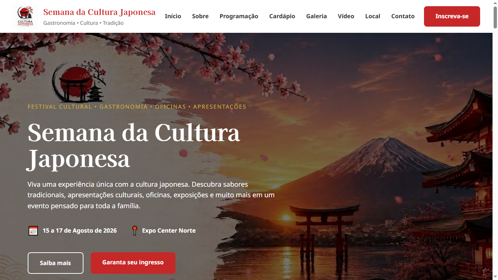

# Semana da Cultura Japonesa

Projeto desenvolvido para a disciplina de Desenvolvimento Web, com o objetivo de criar um website institucional utilizando apenas **HTML5** e **CSS3**, aplicando boas práticas de desenvolvimento, organização do código, semântica, acessibilidade, responsividade e versionamento com Git.

---

## Página Inicial



---

# Autor

**Lucas Souza Viana**

---

# Objetivo do Projeto

Desenvolver um site institucional para divulgar um evento fictício chamado **Semana da Cultura Japonesa**, apresentando informações sobre:

- evento;
- programação;
- gastronomia;
- galeria de imagens;
- vídeo;
- ingressos;
- localização;
- contato.

O projeto foi desenvolvido sem utilização de frameworks, utilizando apenas HTML5 e CSS3 puros.

---

# Tecnologias Utilizadas

- HTML5
- CSS3
- Google Fonts
- Canva
- Git
- GitHub

---

# Funcionalidades

O site possui:

- Header com navegação fixa
- Banner principal (Hero)
- Seção Sobre
- Programação completa dos três dias do evento
- Cardápio com pratos típicos
- Galeria de imagens
- Vídeo em HTML5
- Seção de ingressos
- Formulário de inscrição
- Localização com Google Maps (iframe)
- Informações de contato
- Rodapé institucional
- Layout responsivo

---

# Estrutura do Projeto

```
SEMANA_CULTURA_JAPONESA/

│
├── css/
│   └── style.css
│
├── img/
│   ├── banner.png
│   ├── logo_japones.png
│   ├── icone_logo_japones.png
│   ├── banner (1).png
│   ├── almoco_japones.png
│   ├── Captura_de_tela_pagina_inicial.png
│   ├── salao_evento.png
│   ├── mochi.png
│   ├── oficina_de_origami.png
│   ├── oficina_sushi.png
│   ├── onigiri
│   ├── paisagem_evento_luxo
│   ├── pintura_de_vasos
│   ├── ramen
│   ├── sushi.jpg
│   ├── tempura.jpg
│   ├── yakissoba.jpg
│   ├── icones/
│       ├── email.svg
│       ├── instagram.svg   
│       ├── facebook.svg
│       └── telefone.svg   
│
├── media/
│   └── video_convite.mp4
│
├── index.html
│
└── README.md
```

---

# Estrutura do HTML

O HTML foi desenvolvido utilizando elementos semânticos.

Principais tags utilizadas:

- `<header>`
- `<nav>`
- `<main>`
- `<section>`
- `<article>`
- `<figure>`
- `<figcaption>`
- `<video>`
- `<iframe>`
- `<form>`
- `<footer>`

Também foram utilizados atributos de acessibilidade como:

- alt
- aria-label
- loading="lazy"
- referrerpolicy

---

# Estrutura do CSS

O CSS foi organizado em blocos comentados para facilitar a manutenção.

Principais seções:

- Reset
- Variáveis CSS (:root)
- Container
- Seções
- Header
- Hero
- Sobre
- Programação
- Cardápio
- Galeria
- Vídeo
- Ingressos
- Formulário
- Localização
- Informações
- Rodapé
- Animações
- Responsividade

---

# Recursos de HTML implementados

Durante o desenvolvimento foram utilizados diversos recursos como:

- HTML semântico
- Listas
- Links internos
- Links externos
- Formulários
- Labels
- Inputs
- Select
- Textarea
- Botões
- Vídeo HTML5
- Imagens
- Figure
- Figcaption
- Iframe
- Meta Tags
- Favicon

---

# Recursos de CSS implementados

Foram utilizados diversos recursos de CSS3, incluindo:

- Variáveis CSS (:root)
- Flexbox
- CSS Grid
- Pseudo-classes
- Pseudo-elementos
- Media Queries
- Hover
- Transition
- Transform
- Box Shadow
- Border Radius
- Object-fit
- Position Sticky
- Overflow
- Scroll Behavior
- Backdrop Filter
- Responsividade

---

# Responsividade

O projeto foi desenvolvido utilizando Media Queries para adaptação em diferentes tamanhos de tela.

Breakpoints implementados, ou seja os três Breakpoints foram atendidos:

- Desktop
- Notebook
- Tablet
- Smartphone

A responsividade foi aplicada em:

- Header
- Menu
- Hero
- Cards
- Galeria
- Formulário
- Rodapé
- Google Maps

---

# Acessibilidade

Foram adotadas algumas boas práticas de acessibilidade:

- textos alternativos (alt)
- navegação semântica
- aria-label no menu
- contraste entre cores
- navegação por links
- carregamento otimizado do mapa
- favicon

---

# SEO

O projeto utiliza Meta Tags para otimização de mecanismos de busca.

Foram utilizadas:

- description
- keywords
- author
- viewport

---

# Versionamento

O desenvolvimento foi realizado utilizando Git e GitHub.

Principais comandos utilizados:

```bash
git config --global user.name  

git config --global user.email  

git init

git add .

git commit -m "Descrição"

git push
```

---

# Recursos externos utilizados

## Google Fonts

- Kaisei Decol
- Noto Sans

---

## Google Maps

Mapa incorporado utilizando iframe.

---

## SVG

Os ícones de:

- telefone
- e-mail
- Instagram
- Facebook

---

# Créditos das imagens

As imagens utilizadas no projeto possuem diferentes origens.

### Imagens produzidas por Inteligência Artificial

Algumas imagens ilustrativas foram criadas utilizando ferramentas de Inteligência Artificial do **Gemini** e do **ChatGPT** para fins exclusivamente acadêmicos.

Exemplos:

- banner principal
- ambiente do evento
- oficinas
- paisagens
- algumas imagens da galeria
- cardápio

---

### Vídeo

O vídeo utilizado foi produzido utilizando a plataforma **Canva**, apenas para fins educacionais.

---

### Imagens obtidas da Internet

Algumas imagens de pratos típicos foram obtidas da internet para representar a gastronomia japonesa.

Exemplos:

- Sushi
- Yakissoba
- Tempurá

Todo o material foi utilizado apenas para fins acadêmicos, sem finalidade comercial.

---

# Observações

Este projeto foi desenvolvido exclusivamente para fins acadêmicos como atividade da disciplina de Desenvolvimento Web.

O evento apresentado é fictício e tem como objetivo apenas demonstrar a aplicação prática dos conceitos que deveriam ser estudados durante o semestre anterior.

---

# Aprendizados ou Aprimoramento

Durante o desenvolvimento deste projeto foram aplicados conceitos de:

- HTML5
- CSS3
- Semântica
- Responsividade
- Flexbox
- CSS Grid
- Formulários
- SEO
- Acessibilidade
- Organização de código
- Git
- GitHub

---

# Como executar

1. Baixe ou clone o projeto.

```bash
git clone <url-do-repositorio>
```

2. Abra a pasta do projeto.

3. Execute o arquivo:

```
index.html
```

em qualquer navegador moderno, os testes foram feitos nos navegadores chrome e edge.

---

# Status do Projeto

Projeto concluído.

Desenvolvido para fins acadêmicos.

# Atendimento aos Requisitos do Projeto

O projeto foi desenvolvido seguindo todos os requisitos especificados no documento da disciplina.

## Item 4.1 – Estrutura HTML5

✔ Utilização das principais tags semânticas do HTML5:

- `<header>`
- `<nav>`
- `<main>`
- `<section>`
- `<article>`
- `<figure>`
- `<figcaption>`
- `<video>`
- `<form>`
- `<footer>`

Também foram utilizados atributos semânticos como `alt`, `aria-label`, `required`, `loading="lazy"` e `referrerpolicy`.

---

## Item 4.2 – CSS3

Foram aplicados diversos recursos de CSS3, incluindo:

- Reset CSS
- Variáveis CSS (`:root`)
- Flexbox
- CSS Grid Layout
- Media Queries
- Pseudo-classes (`:hover`, `:focus`, `:nth-child`)
- Pseudo-elementos (`::before`)
- Transições (`transition`)
- Transformações (`transform`)
- Box Shadow
- Border Radius
- Scroll suave (`scroll-behavior`)
- Responsividade para desktop, tablet e smartphone

---

## Item 4.3 – Conteúdo multimídia

O projeto utiliza diferentes tipos de mídia:

- imagens PNG, JPG e SVG
- vídeo MP4 utilizando a tag `<video>`
- mapa incorporado através de `<iframe>`
- favicon personalizado

---

## Item 4.4 – Formulários HTML

Foi desenvolvido um formulário contendo:

- campo de texto
- campo de e-mail
- telefone
- lista de seleção
- campo numérico
- área de texto
- botão de envio

Também foram utilizados:

- `required`
- `min`
- `max`
- tipos específicos de input (`email`, `tel`, `number`)

---

## Item 4.5 – Navegação

O site possui navegação interna através de âncoras, permitindo acessar rapidamente todas as seções:

- Início
- Sobre
- Programação
- Cardápio
- Galeria
- Vídeo
- Local
- Contato

Foi aplicado `scroll-behavior: smooth` para melhorar a experiência do usuário.

---

## Item 4.6 – Responsividade

O layout foi desenvolvido utilizando Design Responsivo com Media Queries para:

- Desktop
- Notebook
- Tablet
- Smartphone

Os elementos reorganizam automaticamente utilizando Flexbox e CSS Grid.

---

## Item 4.7 – Organização do Código

O código foi organizado utilizando comentários para separar cada seção como foi citado anteriormente:

- Reset
- Variáveis
- Header
- Hero
- Sobre
- Programação
- Cardápio
- Galeria
- Vídeo
- Ingressos
- Formulário
- Localização
- Informações
- Rodapé
- Responsividade

A identação e nomenclatura seguem um padrão para facilitar a manutenção.

---

## Item 4.8 – Acessibilidade

Foram aplicados diversos recursos de acessibilidade:

- textos alternativos (`alt`) nas imagens
- uso de tags semânticas
- `aria-label`
- contraste adequado de cores
- formulário identificado com labels
- navegação clara

---

## Item 4.9 – SEO

Foram utilizados elementos básicos de SEO:

- `<title>`
- `meta description`
- `meta keywords`
- `meta author`
- favicon
- estrutura semântica HTML5

---

## Item 4.10 – Publicação

O projeto foi versionado utilizando Git e GitHub.

Repositório:

https://github.com/LUCAS-IF/SEMANA_CULTURA_JAPONESA.git